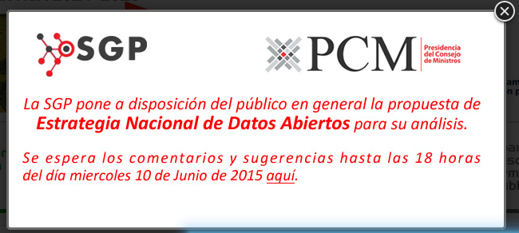
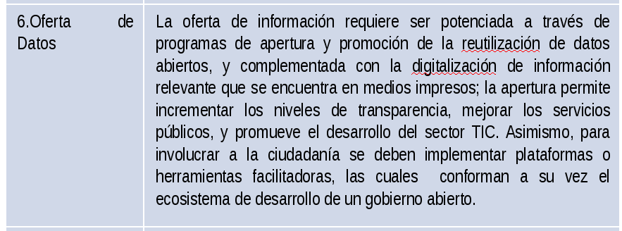
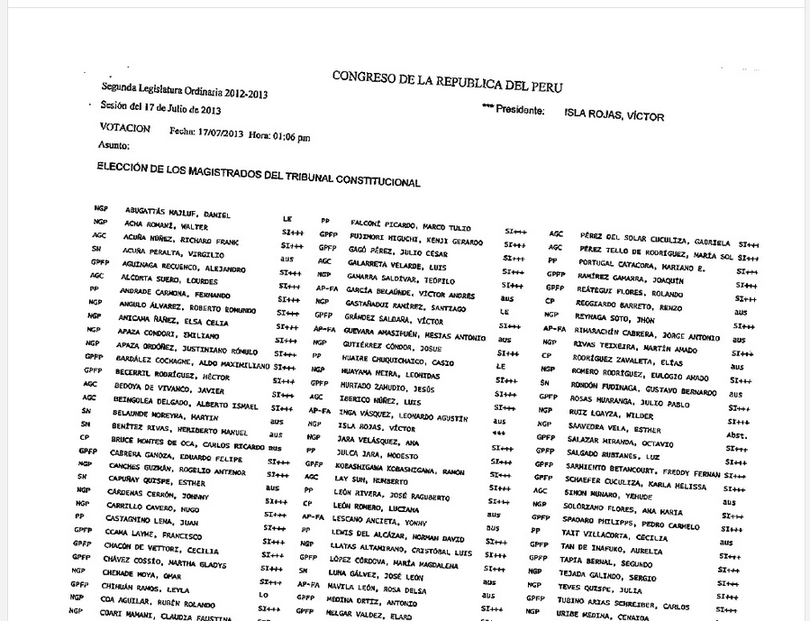
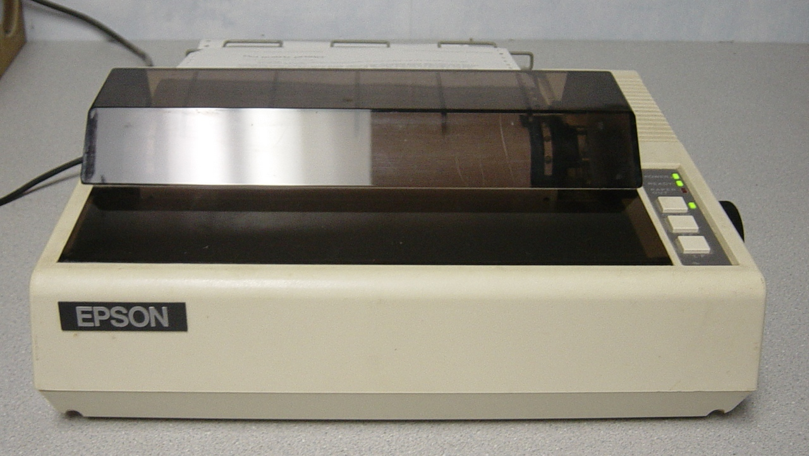
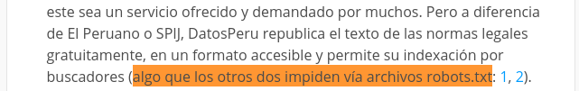

# No vas a creer los XZ comentarios sobre datos abiertos que tenemos para la Secretaría de Gestión Pública

La Secretaría de Gestión Pública, la cual pertenece a la Presidencia del
Consejo de Ministros, quiere entrar a la onda de datos abiertos.

Ha elaborado unos documentos que describen la **Estrategia Nacional de Datos
Abiertos** y han invitado a el público en general que analice y opine,
critique, <strike>trolee,</strike>, etc.

Aquí está la propuesta del Estado en 2 documentos:
<http://www.gestionpublica.gob.pe/foro/viewtopic.php?f=7&t=4>

La idea principal de dicha estrategia es digitalizar una variedad de datos que
contiene el Estado Peruano, y hacerlos disponibles a los ciudadanos,
periodistas de datos, investigadores y emprendedores, con fines de
investigación y periodismo. Todos estos datos estarán disponibles de manera 
abierta (\#datosAbiertos).

La propuesta está en algo, son bonitos deseos y anhelos, pero creemos que le
falta sustancia a la parte técnica. Y sobre todo faltan marcar los objetivos
claros sobre la cancha.

Creemos que la idea es buena, pero la estrategia será más concreta y menos
gaseosa y se le añaden algunas cositas. Por eso en colaboración con mis
amixeres @CestDiego y @McPollo hemos enumerado algunas ideas y
comentarios:

Alcance
-------
1. Qué instituciones estatales digitalizarán sus datos? cuántas?
2. Qué datos se harán disponibles? El registro de visitas del Congreso?
3. Según esta estrategia, el Congreso dejará de publicar los resultados de las
   votaciones en hojas impresas en la EPSON MX-80?

Esto no se puede parsear automáticamente

Ya es hora de cambiar de impresora

Sugerencias y dudas a nivel técnico
-----------------------------------
4. Los documentos de la **gran estrategia** indican que quieren emitir datos
   abiertos en los siguientes formatos: JSON, XML, RDF,
   ODF, CSV, etc. No sería sufiente que publiquen los datos **en un solo
   formato**? Mantener el software que emita tantos formatos no es tarea fácil.
   Además para qué tanta repetición? Pueden hacer  mejor uso de su capital
   humano en otras tareas.
5. Instituciones como el Poder Judicial tiene decenas de GB de info para liberar.
   [Solo las sentencias de la Corte Suprema del año 2013 pesan 11 Gigabytes](http://aniversarioperu.utero.pe/2014/06/17/el-utero-libera-datos-estatales-en-masa/).
   Tienen la infraestructura para bajarse que los ciudadanos puedan descargar
   esta info sin tumbarse sus servidores?
   No sería bueno que usen torrents para que aligeren la carga y faciliten a
   que los ciudadanos interesados compartan la información entre ellos sin
   necesidad de exigir demasiado los servidores del Estado?
   Algunos dirán: **pero los torrents solo se comparte material pirateado**.
   Déjame decirte que:

1. 
   Por alguna razon no quieren que Google y demás indexen sus contenidos.
   \#datosabiertos
que quiten Disable * en el robots.txt de las webs del Estado.

1. No solo los datos deben ser abiertos, también el software para dar chance a 
   que el publico mejore sus sitemas
1. Cuantos repositorios en web quieren tener como objetivo?, para cuando?
1. usaran sistemas como dat project ?

Sugerencias y dudas a nivel administrativo
------------------------------------------
1. quieren que se envie las sugerencias y comentarios por email.
   Debería ser de modo abierto, por ejemplo abriendo un Repo en Github y que la gente comente mediante pull requests.
   He visto ejemplos de otros gobiernos que lo hacen.
1. a esa estragegia/plan le falta un cronograma o calendario:
1. dentro de 6 meses qué parte del sistema de #datos abiertos estará implementado?
1. cuál es el equipo que tienen para hacer esta monumental tarea?
1. cuantos programadores
1. cuantos "digitalizadores" estarán asignados para cada institucion del estado
1. ya han contratado el personal? para cuando los contratrán y cuantos?

Sugerencias sobre el proceso
----------------------------
1. Piden que enviemos las propuestas/comentarios por email. Si el tema de
   discusión es sobre datos abiertos por qué no discutimos de manera abierta?
   Hubieran podido crear un repositorio público en Github para hacer los
   comentarios allí de manera pública. Así podemos ver qué propuestas se hacen
   y, más importante, ver si eventualmente nos escucharán, ver si realmente
   están interesados en nuestro *feedback*. Sería malazo que no les interese
   nuestra opinión y solo pidan *feedback* por cumplir.
1. Es necesario que se aclare la legislación actual respecto a las bases de
   datos con datos personales. El caso **datosperu** es un ejemplo patente del
   conflicto entre la Ley de Transparencia y Ley de Datos Personales. Según una
   ley se puede publicar nombres y apellidos de funcionarios públicos
   relacionados a ciertos hechos administrativos, pero según la otra ley esto
   no se puede hacer. Abogados conocedores de estos temas me dan opiniones
   totalmente opuestas. Obviamente la ley no está clara. Nadie quiere que los
   usuarios de sus datos abiertos terminen sentenciados a multa/cárcel.
   Quizá esto no sea de su ámbito, pero una estrategia con leyes confusas no
   será muy efectiva en alcanzar sus objetivos.
